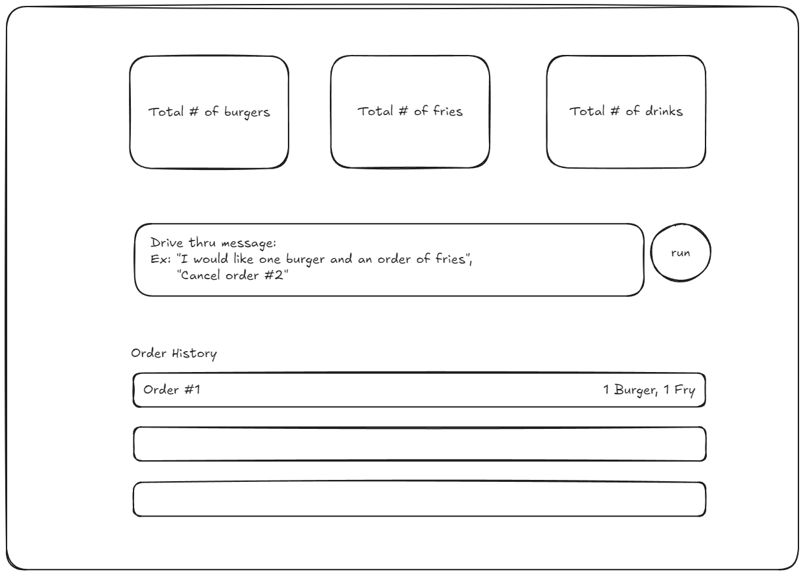

# Instructions

Create a mock drive thru ordering system that allows users to place and cancel their orders using AI.

For this project, assume the order item options are either 1) burgers, 2) fries, or 3) drinks. 

These are examples of user inputs and the corresponding actions to take:
* "I would like to order a burger" -> order of 1 burger
* "My friend and I would each like a fries and a drink" -> order for 2 fries, 2 drinks
* "Please cancel my order, order #2" -> cancel order #2

You will need an LLM to figure out the actions, you cant just search the text for keywords in general. You can assume every user input is either for an order and includes the items to order, or a cancellation with the order number to cancel, but the exact text and structure of the sentences could vary.

# Setup

See backend/README.md and frontend/README.md for setup instructions

# Criteria

1. Create a UI in Svelte that shows the total number of items that have been ordered, a list of placed orders and has a single text box for new user requests
2. Implement a backend using FastAPI that uses OpenAI's function calling to allow users to place or cancel their orders
3. Orders can contain one or multiple items and 1 or multiple quantities of each item
4. Placing or cancelling orders should be reflected in the UI

# Feedback

Some troubleshooting with this assessment:

* Poetry kept erroring out, had to find workthroughs with pipx installing, and poetry itself wouldn't run the uvicorn, but uvicorn itself would run without 'poetry run ...' so probably user error
* accessing open ai key, despite my dashboard recording 0 usage, kept erroring out on requests and saying I've used up all my free credits. Not certain why that was occurring but couldn't actually 'test' the api, sadly
* essentially did the mockup for how it would've received the information on the client side, and slotted the imaginary data accordingly. Again, couldn't test for real so not certain how I would've needed to tweak the received data
* Apologies for its incompletion, it just did not seem to want to work with me.